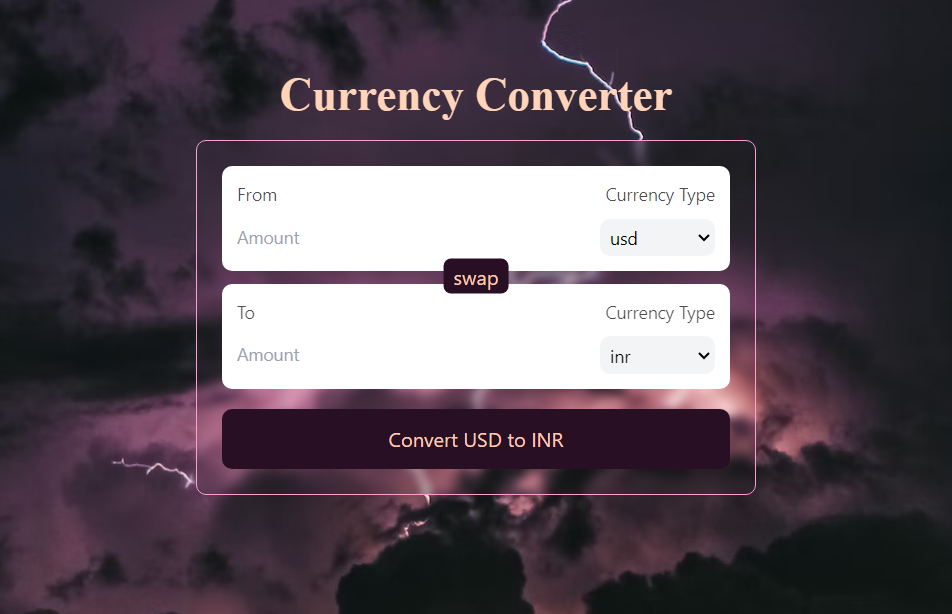

# Currency Converter

This is a simple ReactJS application that converts currencies using the [Exchange Rates API](https://cdn.jsdelivr.net/gh/fawazahmed0/currency-api@1/latest/currencies.json).

()

> This project was bootstrapped with [Vite](https://vitejs.dev/).   

## How to run
1. Clone this repository
2. Run `npm install` to install dependencies
3. Run `npm run dev`
4. Open [ http://localhost:5173/]( http://localhost:5173/) to view it in the browser.

### What I learned in this project
- How to use React Hooks
- How to use Custom React Hooks (and why to use them)
- It was my first time using Tailwind CSS (I really like it)
- 
### Completions
- This project is complete on my end but if you have any suggestions, please let me know by opening an issue or a pull request. Thankyou!